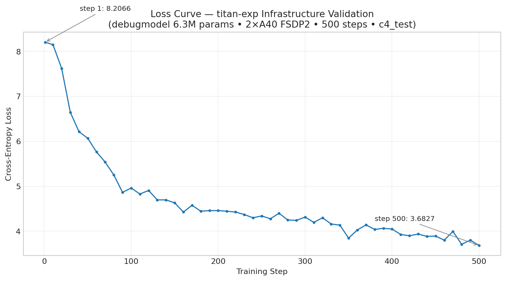
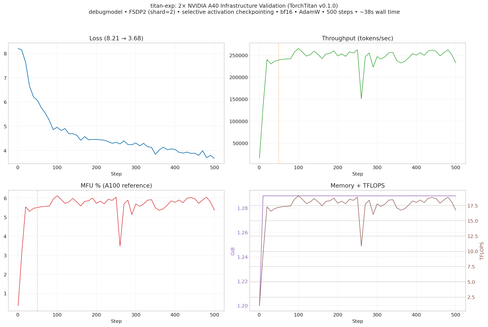

# titan-exp

TorchTitan infrastructure validation on a 2× NVIDIA A40 RunPod pod.

**Goal:** prove the 2-GPU distributed training stack works end-to-end (FSDP2, metrics, checkpoints, stability). This is **not** a model-quality or convergence experiment.

## Status

- **Core infrastructure validated** (smoke test + 500-step run with full artifacts and graphs).
- **Llama 3.1 8B run:** Attempted with provided HF token. Blocked on gated tokenizer (`meta-llama/Meta-Llama-3.1-8B`). HF access approval is in progress. Re-run pending.

## Compute Environment

| Component | Specification |
|-----------|---------------|
| Provider | RunPod |
| GPUs | 2× NVIDIA A40 (44.4 GiB each) |
| PyTorch | 2.6.0+cu124 |
| TorchTitan | v0.1.0 (pinned; `torchtitan/`) |

**Note:** Newer TorchTitan requires PyTorch 2.8+/CUDA 13, which is incompatible with this pod.

## Required NCCL Settings

On this pod, multi-GPU NCCL hangs unless P2P is disabled:

```bash
export NCCL_P2P_DISABLE=1
export NCCL_IB_DISABLE=1
```

`run_experiment.sh` sets these automatically.

## Experiment Plan

| Phase | Config | Steps | Status |
|-------|--------|-------|--------|
| 1. Setup | TorchTitan v0.1.0 + PyTorch 2.6 cu124 | — | ✅ Done |
| 2. Smoke test | `debug_model.toml` (tiny model) | 10 | ✅ Done |
| 3. Infrastructure run | `configs/infrastructure_run.toml` | 500 | ✅ Done |
| 4. Llama 3.1 8B run | `configs/llama3_8b_2gpu.toml` (real C4, seq 8k) | 500 | ⏸ Pending (HF gated access approval in progress) |

The debugmodel (6.27M params) + `c4_test` dataset (tiny, loops frequently) is sufficient to validate the full distributed pipeline without gated assets.

## Standard Stack

- FSDP2 (`data_parallel_shard_degree=-1`)
- Selective activation checkpointing
- bf16 mixed precision
- Fused AdamW
- No torch.compile / Float8 / TP / PP / CP

## Results

### Smoke Test (10 steps)

Completed in ~13s. Loss decreased monotonically. Both GPUs active via FSDP.

### Infrastructure Validation (500 steps)

**Config:** `configs/infrastructure_run.toml`  
**Log:** `outputs/infrastructure-run.log`  
**Duration:** ~38 seconds

| Metric | Step 1 | Step 250 | Step 500 |
|--------|--------|----------|----------|
| Loss | 8.2066 | 4.3399 | 3.6827 |
| Memory (reserved) | 1.20 GiB | 1.29 GiB | 1.29 GiB |
| Throughput (global) | 15,408 tps | ~250k tps | 232,910 tps |
| MFU (A100 ref) | 0.36% | ~6% | 5.37% |

**Checks:**
- 500 steps, no OOM, stable
- Loss trended cleanly downward
- FSDP2 sharded across both GPUs
- Checkpoints written at steps 1/250/500 (DCP, 2 shards each)
- TensorBoard enabled
- No NCCL hangs (with env vars)

**Notes:**
- MFU uses A100 peak FLOPS fallback (A40 not in TorchTitan lookup).
- `c4_test` (~2k samples) re-loops every ~40 steps — expected for this validation set.

### Graphs

High-resolution plots generated from the structured log (51 points) using matplotlib.

**Location:** `outputs/infrastructure-run/graphs/`

Key plots:

**Loss curve**



**Combined dashboard (loss, throughput, MFU, memory + TFLOPS)**



Other plots available in the same directory:
- `02_throughput_tps.png`
- `03_mfu.png`
- `04_memory.png`
- `05_tflops.png`
- `metrics_summary.txt`

Observations:
- Sharp initial loss drop, continued improvement.
- Throughput ramps after warmup (~step 50) and sustains ~240-260k tps.
- Memory stable and tiny (as expected for debugmodel).
- MFU consistent in the 5.5–6.1% range (A100 reference).

## Current Status & Remaining Work

The 2× A40 FSDP2 stack (launch, sharding, metrics, checkpointing, long-running stability) is fully validated with visual evidence.

The Llama 3.1 8B experiment (real dataset, 8k sequence length, meaningful batch) was attempted using the supplied token. It failed at the gated tokenizer download step (403 from HF). Approval for the model on the providing account is in progress.

**Next:**
- Once a working HF token with access is available, re-run:
  ```bash
  CONFIG_FILE=configs/llama3_8b_2gpu.toml ./run_experiment.sh
  ```
- This will produce the corresponding 8B log, checkpoints, TB, and new graphs under `outputs/llama3-8b-run/`.

Details of the blocked attempt are in `outputs/llama3-8b-attempt.log` and `outputs/llama3-8b-run/NOTE-ATTEMPT.txt` (sanitized).

## Artifacts

```
outputs/
├── smoke-test/                 # 10-step smoke artifacts + log
├── infrastructure-run/
│   ├── checkpoint/             # step-1, step-250, step-500 (DCP)
│   ├── tb/                     # TensorBoard events
│   ├── graphs/                 # matplotlib results (loss, tps, mfu, etc.)
│   └── infrastructure-run.log
├── llama3-8b-attempt.log       # Sanitized failure transcript (8B attempt)
└── llama3-8b-run/              # Stub dir + note from 8B attempt
```

Large binary checkpoints (`.distcp`) are present but typically excluded from git.

## Project Layout

```
titan-exp/
├── configs/                    # infrastructure_run.toml + llama3_8b_2gpu.toml
├── outputs/                    # run artifacts (see above)
├── run_experiment.sh           # launcher (sets NCCL vars + torchrun)
├── requirements.txt
└── torchtitan/                 # Pinned TorchTitan v0.1.0 checkout
```

## References

- [TorchTitan](https://github.com/pytorch/torchtitan)
- [RunPod](https://www.runpod.io/)
