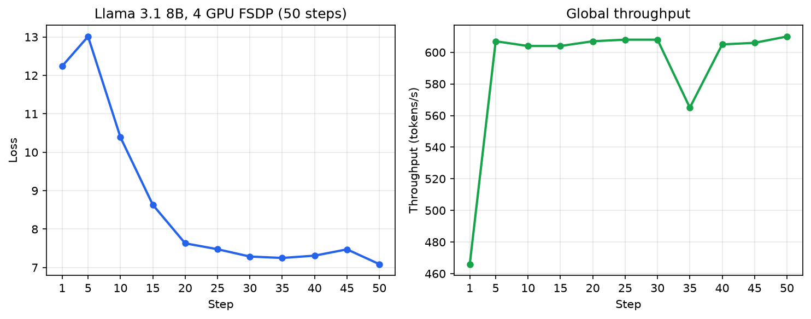

# TorchTitan Setup

TorchTitan v0.1.0 launcher for multi-GPU training on [RunPod](https://www.runpod.io) (4× H100). Set `NGPU` and `CONFIG_FILE`, then run `./run.sh`.

## Latest result: Llama 3.1 8B, 4 GPU

Validated run on 2026-06-19 (4× H100, FSDP, C4, 50 steps, ~11 min, global batch 4):



```bash
NGPU=4 CONFIG_FILE=configs/llama3_8b.toml ./run.sh \
  --training.steps 50 --metrics.log_freq 5 --checkpoint.no-enable-checkpoint
```

Checkpointing must be disabled for 8B runs (see [`docs/CHECKPOINT.md`](docs/CHECKPOINT.md)).

## One-time setup

```bash
cd titan-setup
./setup_env.sh
source .venv/bin/activate
```

## How to launch

Every run follows the same pattern:

```bash
NGPU=<gpus> CONFIG_FILE=configs/<config>.toml ./run.sh
```

- `NGPU`: how many GPUs to use (FSDP shards across them automatically)
- `CONFIG_FILE`: which config to run
- Extra flags after `./run.sh` override config values (e.g. `--training.steps 10`)

Outputs go to `outputs/<config-name>/`.

---

## Config 1: `debugmodel.toml` (quick test)

A tiny 6M-parameter model on a small public dataset. No Hugging Face token needed. Use this to verify the setup works.

```bash
# 1 GPU smoke test (10 steps)
NGPU=1 CONFIG_FILE=configs/debugmodel.toml ./run.sh --training.steps 10

# 4 GPU with FSDP
NGPU=4 CONFIG_FILE=configs/debugmodel.toml ./run.sh --training.steps 10

# Full 500-step run (config default)
NGPU=2 CONFIG_FILE=configs/debugmodel.toml ./run.sh
```

| | |
|---|---|
| Model | llama3 debugmodel (~6.3M params) |
| Dataset | c4_test (built-in, ~2K samples) |
| Seq length | 2048 |
| HF token | Not required |

---

## Config 2: `llama3_8b.toml` (real model)

Llama 3.1 8B on the full C4 dataset.

### Hugging Face token

You need a token from an account approved for [meta-llama/Meta-Llama-3.1-8B](https://huggingface.co/meta-llama/Meta-Llama-3.1-8B). 

`./setup_env.sh` creates a `.env` file in the repo root. Open it and set your token:

```
HF_TOKEN=hf_xxxxxxxxxxxxxxxxxxxxxxxxxxxxxxxx
```

The file is gitignored. You can also pass the token via `export HF_TOKEN=...` in your shell instead.

### Download tokenizer and run

```bash
./download_8b_tokenizer.sh

NGPU=4 CONFIG_FILE=configs/llama3_8b.toml ./run.sh \
  --training.steps 50 --metrics.log_freq 5 --checkpoint.no-enable-checkpoint
```

| | |
|---|---|
| Model | Llama 3.1 8B |
| Dataset | c4 |
| Seq length | 8192 |
| HF token | Required for tokenizer download only |
| Checkpoints | Use `--checkpoint.no-enable-checkpoint` (see [`docs/CHECKPOINT.md`](docs/CHECKPOINT.md)) |

---

## Notes

**Changing GPU count:** clear old checkpoints first (dataloader state is per-rank):

```bash
rm -rf outputs/debugmodel/checkpoint
```

**3+ GPUs:** `run.sh` sets `NCCL_NVLS_ENABLE=0` by default. See [`docs/NCCL.md`](docs/NCCL.md) for details.

**Stack:** TorchTitan v0.1.0, PyTorch 2.6.0+cu124, FSDP2.
